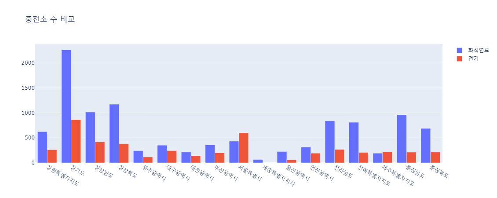
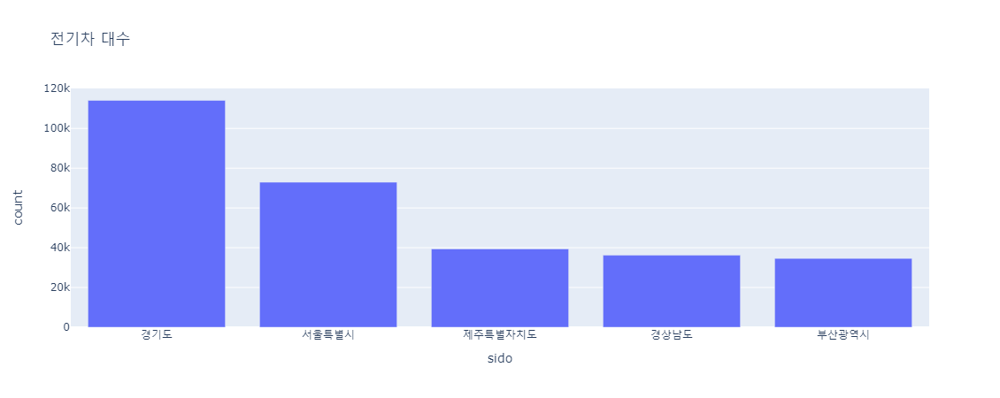
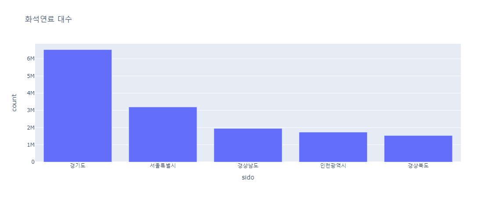

# 전국 전기차 및 전기차 충전소 보급 현황 분석  

- 참여자:
  - [최성현](https://github.com/S0rrow)
  - [유정연](https://github.com/yjyj989812)
  - [김승주](https://github.com/tmdwnabc)
  - [이충원](https://github.com/cw3714)
  - [신소영](https://github.com/soyoungshin1)

---
## 1. Back-Ground
- 기후변화 대응을 위해 2020년도 정부 주도의 전기차 보조금 지원 사업을 시작으로 전기차 보급이 시작되였습니다.
- 보조금 사업 시행한지 4년이 경과한 지금 전기차 보급 및 전기차에 필요한 전기차 충전소 설치가 부족함이 없는지 알고자 프로젝트를 진행하였습니다.

---
## 2. Goals
> 1. 전국 주유소, 전기차 충전소 데이터를 이용하여 각 시설의 갯수 및 분포 현황을 확인
> 2. 전국 전기차와 화석연료차량의 등록 데이터를 이용하여 지역별 차량 대수 및 특이사항이 존재하는지 확인

---

## 3. Development Condition

해당 프로젝트의 개발 환경은 다음과 같습니다.

1. Python 3.10: 데이터를 시각화하고 실행 코드를 작성하기 위해 Python3를 사용했습니다.   
    - Python Modules: Python의 다양한 외부 패키지의 활용과 개발 환경 보존을 위해 pip와 venv를 사용했습니다.
    - 해당 프로젝트에 사용된 주요 패키지는 다음과 같습니다.
        - Pandas: 대량의 데이터를 처리하기 위해 사용했습니다.
        - requests: 웹과 API를 통해 데이터를 가져오기 위해 사용했습니다.
        - BeautifulSoup: 웹을 통해 가져온 데이터를 파싱하기 위해 사용했습니다.
2. Github: 프로젝트의 개발 과정과 코드를 보존하기 위해 Git과 Github를 사용했습니다.
3. MySQL: 프로젝트의 데이터를 저장하고 다시 끌어오기 위해 MySQL을 사용했습니다.

---

## 4. API Used
본 프로젝트에 사용된 데이터는 OpenAPI 및 오픈되어 있는 사이트들에서 제공하는 데이터를 사용해 구성되었습니다.
사용된 API 및 사이트들의 목록은 다음과 같습니다.
| - | API | Details |
|:---|:---|:---|
| 1 | [네이버 Geocoding API](https://api.ncloud-docs.com/docs/ai-naver-mapsgeocoding) | 주소를 좌표값으로 변환|
| 2 | [행정안전부 도로명주소 사이트](https://www.juso.go.kr/openIndexPage.do) | 지번주소를 도로명주소로 변환하기 위해 사용했습니다. |
| 3 | [전력데이터 개방 포털시스템](https://tinyurl.com/27ej5rbl) | 전기차 충전소 현황에 대한 데이터 수집 |
| 4 | [ChargeInfo 전기차 등록 현황](https://tinyurl.com/2yeqnkb9) | 전국의 연도별 전기차 등록 현황 및 전기차 충전소 현황에 대한 데이터 수집 |
| 5 | [네이버 차량 정보 검색 결과](https://search.naver.com/search.naver?where=nexearch&sm=top_hty&fbm=0&ie=utf8&query=%EC%9E%90%EB%8F%99%EC%B0%A8) | 검색 결과로부터 차량 정보 수집|
| 6 | [환경빅데이터 플랫폼 전기자동차 월 전력수요량 예측 데이터](https://tinyurl.com/228cgdun) | 전국 시도별 전기자동차 전력수요량을 예측한 데이터 수집 |
| 7 | [국토교통 통계누리 전국 자동차등록현황보고](https://tinyurl.com/23ha88m4) | 연도별로 전국에 등록된 모든 종류(전기차, 하이브리드, 내연차량)의 차량 정보를 수집 |

---

## 5. 주유소-전기충전소 비교
- 시도별 주유소 및 전기충전소는 다음과 같습니다.

---

## 6. 화석연료차량-전기차 비교
시도별 전기차 및 화석연료차량 등록수가 많은 지역은 다음과 같습니다.
- 전기차

---
- 내연 차량

---
## 7. 전국 전기충전소 및 주유소 분포도

- [전국 전기차 충전소 좌표](ev_cs_map.html)
- [전국 주유소 좌표](gs_map.html)

---
## 8. 결론

- 서울과 제주도를 제외한 나머지 지역들은 전기충전소 보급이 부족한 편이며, 특히 남부지역을 중심으로 전기충전소 부족현상이 관측됩니다.
- 서울과 제주도가 충전소 보급률이 높은 이유에 대한 추정은 다음과 같습니다.
  - 서울: 인프라 발달 및 인구수가 많아 전기차 및 충전소 보급 우선이 높음
  - 제주도: 환경 보호 및 관광지라는 특수성으로 인해 인구수와 면적에 비해 전기차 수와 충전소 수 자체가 많음
- 최종적으로 전기차 충전소가 추구해야할 방향은 전국 주유소 분포도라고 보며, 각 지방 및 도시를 연결하는 도로망, 인구수가 많으나 상대적으로 전기차 및 충전소 보급이 적은 지방을 중심으로 전기차 보급 및 충전소 설치 지원이 이루어저야한다고 봅니다.